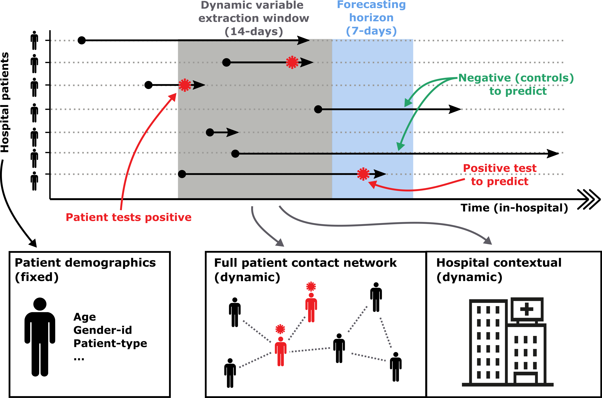

# Predicting hospital aquired infections using dynamic networks of contact

## Paper overview

**Citation**

Myall, A. C., Peach, R. L., Wan, Y., Mookerjee, S., Jauneikaite, E., Bolt, F., Price, J. R., Davies, F., Wiesse, A. Y., Holmes, A., & Barahona, M. (2021). Characterising contact in disease outbreaks via a network model of spatial-temporal proximity. *MedRxiv*, 2021.04.07.21254497. https://doi.org/10.1101/2021.04.07.21254497.

This article introduced, tested, and validated an infection forecasting tool for primary use in hospitals. The tool incorporates dynamically changing variables to make predictions for each patients risk of acquiring a disease. Specifically, our framework accounts for contact patterns, a significant driver of many infectious diseases, to capture disease aquistion risk. In the article, we deployed the forecasting tool onto hospital-onset COVID-19 infections, demonstrating both its high efficacy and generalisability.

<p align="center">
  
</p>

<sub>*Forecasting framework overview. Patient pathways are extracted from electronic health records which specify the locations each patient has visited over the duration of their hospital stay. These pathways are then overlaid with COVID-19 testing results, capturing the space-time positions of patients that tested positive for COVID-19. For predictions we define a time window and for each patient extract clinical variables (fixed) and hospital contextual variables (dynamic), and their position in a contact network (dynamic). This process of variable extraction is then repeated for multiple time windows, with total information used for model training and predictions.*</sub>


## Repo overview

This repo provides an implementable example of the model proposed in *Myall et al. 2021.*  `R/` is the folder for scripts that contain R functions. All functions are documented with [roxygen2](https://roxygen2.r-lib.org/) syntax.

### Example data

The framework is flexible and can intergrate a wide range of variables. However, the main functionality relies on patient pathways, with test results (date and result) detailing when and where someone was identified as infected. We provide examples of both data which can be called using `getExamplePathways()` and `getExampleTesting()`.

```R
#  Read in example patient pathways
pathways = read.csv("data/examplePathways.csv")

# Read in example patient testing results
tests = read.csv("data/exampleTests.csv")

# Join pathways with test results by patient identifier
pathwaysWithTests = left_join(pathways,tests, by = c("Ptnumber"))
```

Pathways are stored in a long format, specifying a patient identifier in `pathways$Ptnumber`, their location and time at that location in `pathways$location`, and `pathways$t` respectively, and then the date of their first positive test result in `pathways$posTestResDt`. 

In addition data in `data/staticVars.csv` can contained fixed attributes of a patient used for prediction, and data in `data/contextualVars.csv` contains background statisitics that change over time, and can also be intergrated into the prediction framework.

The dataset `data/background_movement.csv` is

```R
# Read in example patient static variables
staticVars = read.csv("data/exampleStaticVars.csv")

# Read in example contextual variables
contextualVars = read.csv("data/exampleContextualVars.csv")
```

### Pre-process

The function `preProRollingWind()` is a wrapper function that is applied over a sliding time window of length `feature_n`. In sumarry, the function: (i) splits the data into windows, (ii) constructs a contact network, and then centrality of each patient across it, (iii) derives the background contextual variable for a window, and (iii) joins the patient statistics within the window with static variables.


```R
# Run pre-proccesing over a sliding time window
preProRollingWind(pathwaysWithTests,  # Patient pathways with tests (when a patient become positive)
                  staticVars,         # Static variables (i.e. age, gender, ...)
                  contextualVars,     # Background contextual variables (hospital infection numbers)
                  feature_n = 14,     # Time window size to compute variables over
                  prediction_n = 7)   # Forecasting horizon
```

Pre-processing data over large periods of time, or with many individuals can increase copmutational expendeiture. We advice the user to experiement with the parallel implemtation of the pre-processing function, `preProRollingWindPar()`.

```
[1] "Pre-processing data"
  |=============================================================================================           |  89%
```

### Clean data
Data pre-processing files are read in, aggregated, and cleaned, to produce final data suitable for statistical analysis.

```R
# Loads and aggregates saved files (fixed and static variables are read in and joined by patient-timecode IDs)
stat.df = loadPreData()

# Clean (add infection labels)
stat.df.clean = loadPreData(stat.df)

# Prepare modelling dataset (Scale data, remove redundency, under-sample, split into train/test)
trainTestData.l = PreModelData(stat.df.clean)
```

### Statistical analysis

The cleaned datasets are finally analysed following the paper by (i) performing a univariate analysis over variables grouped and averaged across patients and (ii) fitting a model to predict disease. The prediction model is implemented using `caret` and thus can be flexibly changed and compared.

```R
# Univariate analysis
uniVarAnalysis(trainTestData.l)

# Run prediction model
caret::train(Infection ~., data = trainTestData.l$train,method='rf')

```


